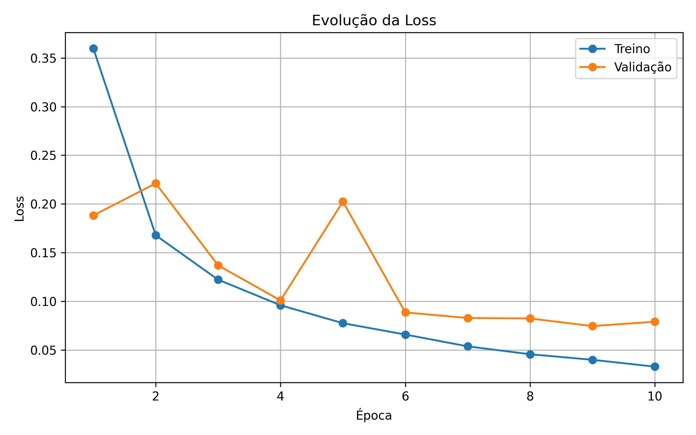
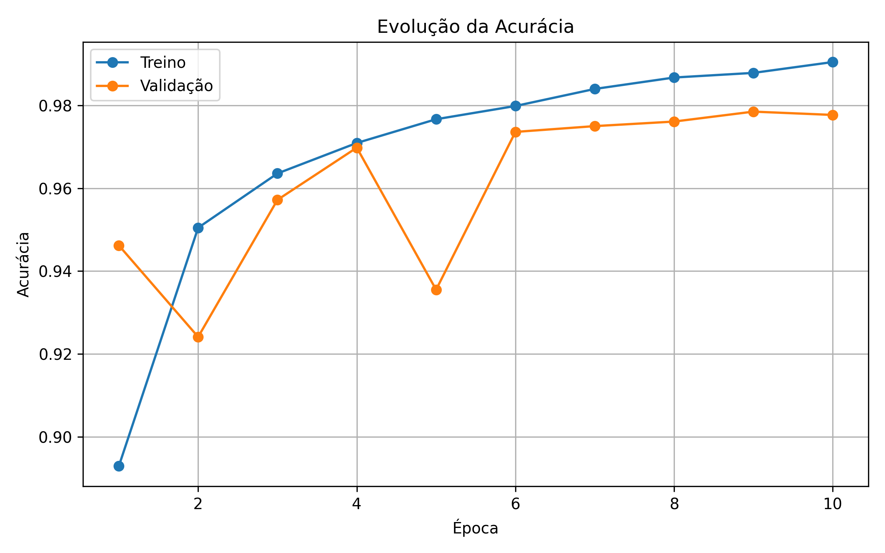
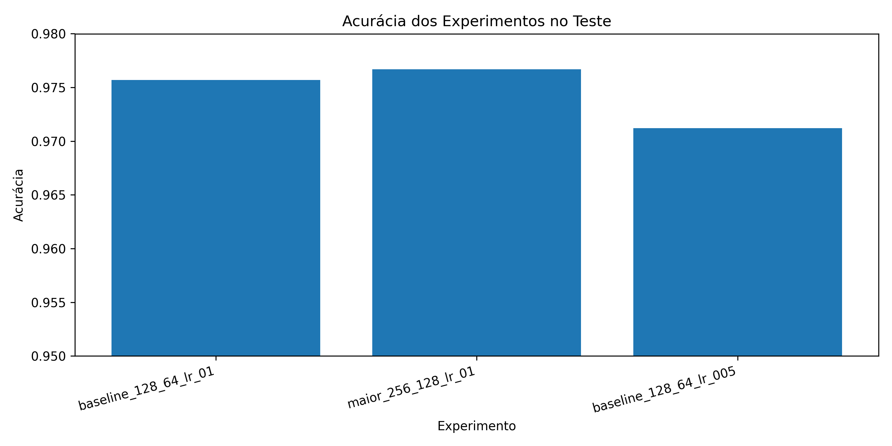
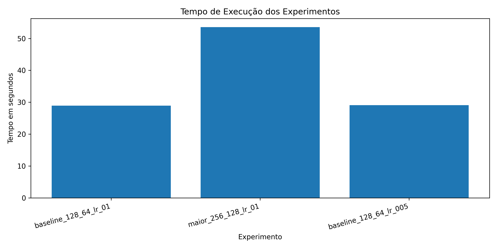

# MLP do Zero com NumPy - Classificação de Dígitos MNIST

Este projeto implementa uma rede neural **Multi-Layer Perceptron (MLP)** do zero utilizando **NumPy**, com o objetivo de classificar dígitos manuscritos do dataset **MNIST**.

A proposta da atividade é construir uma rede neural sem usar frameworks prontos de deep learning, como TensorFlow, Keras ou PyTorch. Por isso, todas as partes principais da rede foram implementadas manualmente: inicialização dos pesos, forward pass, funções de ativação, softmax, cross-entropy, backpropagation, atualização dos pesos com SGD, treinamento com mini-batches e avaliação do modelo.

A meta mínima definida para o projeto era alcançar pelo menos **92% de acurácia no conjunto de teste**. O melhor modelo treinado neste projeto alcançou **97,67% de acurácia**, superando a meta proposta.

---

## Sumário

* [Objetivo](#objetivo)
* [Estrutura do projeto](#estrutura-do-projeto)
* [Explicação dos arquivos](#explicação-dos-arquivos)
* [Como executar](#como-executar)
* [Dataset utilizado](#dataset-utilizado)
* [Arquitetura da MLP](#arquitetura-da-mlp)
* [Funcionamento do modelo](#funcionamento-do-modelo)
* [Treinamento](#treinamento)
* [Resultados](#resultados)
* [Comparação dos modelos](#comparação-dos-modelos)
* [Gráficos gerados](#gráficos-gerados)
* [Decisões técnicas e dificuldades](#decisões-técnicas-e-dificuldades)
* [Conclusão](#conclusão)

---

## Objetivo

O objetivo principal foi desenvolver uma MLP capaz de reconhecer imagens de dígitos manuscritos do dataset MNIST.

Cada imagem do MNIST possui dimensão **28x28 pixels**. Como a MLP recebe vetores como entrada, cada imagem foi transformada em um vetor de **784 valores**.

A rede recebe esse vetor e retorna uma probabilidade para cada uma das 10 classes possíveis:

```txt
0, 1, 2, 3, 4, 5, 6, 7, 8, 9
```

A classe escolhida pelo modelo é aquela que possui a maior probabilidade na saída da rede.

---

## Estrutura do projeto

A estrutura final do projeto ficou organizada da seguinte forma:

```txt
.
├── README.md
├── requirements.txt
├── train_mnist.py
├── compare_experiments.py
├── plot_results.py
├── mlp/
│   ├── __init__.py
│   ├── activations.py
│   ├── data.py
│   ├── losses.py
│   ├── network.py
│   └── optimizers.py
└── results/
    ├── experimentos.csv
    ├── historico_treino.csv
    ├── loss_por_epoca.png
    ├── acuracia_por_epoca.png
    ├── comparacao_acuracia.png
    └── comparacao_tempo.png
```

---

## Explicação dos arquivos

### `README.md`

Arquivo principal de documentação do projeto. Ele explica o objetivo, a estrutura, o funcionamento da rede, o treinamento, os resultados obtidos, a comparação dos experimentos e as principais decisões técnicas tomadas durante o desenvolvimento.

---

### `requirements.txt`

Arquivo com as dependências necessárias para executar o projeto.

As principais bibliotecas usadas foram:

```txt
numpy
matplotlib
scikit-learn
pandas
jupyter
```

O `numpy` foi usado para implementar todos os cálculos matemáticos da rede. O `matplotlib` foi usado para gerar os gráficos. O `scikit-learn` foi usado para carregar o MNIST e separar os dados. O `pandas` foi necessário como dependência auxiliar do carregamento via OpenML. O `jupyter` foi incluído para permitir análises em notebook.

---

### `train_mnist.py`

Script responsável por executar o treinamento principal da MLP no MNIST.

Ele realiza o seguinte fluxo:

```txt
1. Carrega o dataset MNIST
2. Normaliza os pixels
3. Converte os rótulos para one-hot encoding
4. Cria uma MLP
5. Treina o modelo
6. Salva o histórico de treino
7. Avalia o modelo no conjunto de teste
```

A configuração principal utilizada nesse script foi:

```txt
Arquitetura: 784 → 128 → 64 → 10
Ativação: ReLU
Otimizador: SGD
Learning rate: 0.1
Batch size: 64
Épocas: 10
```

---

### `compare_experiments.py`

Script responsável por comparar diferentes configurações da MLP.

Ele executa três experimentos principais:

```txt
baseline_128_64_lr_01
maior_256_128_lr_01
baseline_128_64_lr_005
```

Cada experimento altera a arquitetura ou o learning rate, permitindo comparar desempenho, loss e tempo de execução.

Os resultados são salvos em:

```txt
results/experimentos.csv
```

---

### `plot_results.py`

Script responsável por gerar os gráficos finais do projeto a partir dos arquivos CSV gerados durante o treinamento e os experimentos.

Ele gera os seguintes arquivos:

```txt
results/loss_por_epoca.png
results/acuracia_por_epoca.png
results/comparacao_acuracia.png
results/comparacao_tempo.png
```

Esses gráficos são usados na documentação para visualizar a evolução do treinamento e comparar os modelos testados.

---

### `mlp/__init__.py`

Arquivo que indica que a pasta `mlp` é um pacote Python. Isso permite importar os módulos do projeto, por exemplo:

```python
from mlp.network import MLP
```

---

### `mlp/activations.py`

Arquivo com as funções de ativação usadas pela rede neural.

Foram implementadas:

```txt
ReLU
Sigmoid
Tanh
```

Também foram implementadas suas respectivas derivadas, necessárias para o backpropagation.

A função mais usada nos experimentos foi a **ReLU**, pois ela é simples, eficiente e funciona bem em redes com múltiplas camadas ocultas.

A ReLU funciona assim:

```txt
ReLU(x) = x, se x > 0
ReLU(x) = 0, se x <= 0
```

---

### `mlp/losses.py`

Arquivo com funções relacionadas à saída da rede e ao cálculo do erro.

Foram implementadas:

```txt
softmax
cross_entropy
accuracy
one_hot_encode
```

A `softmax` transforma os valores brutos da última camada em probabilidades.

A `cross_entropy` calcula o erro entre a previsão da rede e o rótulo real.

A `accuracy` calcula a porcentagem de acertos.

A `one_hot_encode` transforma rótulos inteiros em vetores binários.

Exemplo:

```txt
Rótulo: 3

One-hot:
[0, 0, 0, 1, 0, 0, 0, 0, 0, 0]
```

---

### `mlp/optimizers.py`

Arquivo responsável pelo otimizador da rede.

Foi implementado o **SGD**, ou Stochastic Gradient Descent.

A regra de atualização é:

```txt
parâmetro = parâmetro - learning_rate * gradiente
```

O SGD usa os gradientes calculados pelo backpropagation para ajustar os pesos e vieses da rede.

---

### `mlp/network.py`

Arquivo principal do projeto. Ele contém a classe `MLP`.

Essa classe implementa:

```txt
inicialização dos pesos
forward pass
backpropagation
atualização dos pesos
treinamento com mini-batches
avaliação
predição
resumo da arquitetura
```

A implementação foi feita de forma flexível, permitindo criar redes com diferentes quantidades de camadas e neurônios.

Exemplo:

```python
model = MLP(
    layer_sizes=[784, 128, 64, 10],
    activation="relu",
    learning_rate=0.1
)
```

---

### `mlp/data.py`

Arquivo responsável por carregar e preparar o MNIST.

Ele realiza:

```txt
carregamento do dataset
normalização dos pixels
separação entre treino, validação e teste
conversão dos rótulos para one-hot encoding
```

Os pixels originalmente variam de 0 a 255. Eles foram normalizados para o intervalo entre 0 e 1:

```python
X = X / 255.0
```

Essa normalização ajuda o treinamento, pois evita trabalhar com valores muito grandes na entrada da rede.

---

### `results/`

Pasta onde ficam os arquivos de saída do projeto.

Ela contém:

```txt
experimentos.csv
historico_treino.csv
loss_por_epoca.png
acuracia_por_epoca.png
comparacao_acuracia.png
comparacao_tempo.png
```

Os arquivos `.csv` guardam os valores numéricos dos treinamentos e os arquivos `.png` guardam os gráficos usados nesta documentação.

---

## Como executar

### 1. Criar o ambiente virtual

Na raiz do projeto, execute:

```powershell
python -m venv .venv
```

---

### 2. Ativar o ambiente virtual

No PowerShell:

```powershell
.\.venv\Scripts\Activate.ps1
```
Depois, ative:

```powershell
.\.venv\Scripts\Activate.ps1
```

---

### 3. Instalar as dependências

```powershell
python -m pip install -r requirements.txt
```

---

### 4. Treinar o modelo principal

```powershell
python train_mnist.py
```

Esse comando treina a arquitetura principal da MLP e salva o histórico em:

```txt
results/historico_treino.csv
```

---

### 5. Rodar a comparação de experimentos

```powershell
python compare_experiments.py
```

Esse comando treina diferentes configurações da MLP e salva os resultados em:

```txt
results/experimentos.csv
```

---

### 6. Gerar os gráficos

```powershell
python plot_results.py
```

Esse comando gera os gráficos dentro da pasta `results/`.

---

## Dataset utilizado

O dataset utilizado foi o **MNIST**, composto por imagens de dígitos manuscritos.

Cada imagem possui:

```txt
28 x 28 pixels
```

Como a rede é uma MLP, a imagem é transformada em um vetor:

```txt
28 x 28 = 784 entradas
```

Portanto, a camada de entrada da rede possui **784 neurônios**.

Os rótulos representam os dígitos de 0 a 9. Como a saída da rede possui 10 neurônios, os rótulos foram convertidos para one-hot encoding.

A divisão usada foi:

```txt
Treino: 50.000 imagens
Validação: 10.000 imagens
Teste: 10.000 imagens
```

---

## Arquitetura da MLP

A arquitetura principal escolhida foi:

```txt
784 → 128 → 64 → 10
```

Ela possui:

```txt
Camada de entrada: 784 neurônios
Primeira camada oculta: 128 neurônios
Segunda camada oculta: 64 neurônios
Camada de saída: 10 neurônios
```

Essa arquitetura atende ao requisito de possuir pelo menos **duas camadas ocultas**.

A entrada possui 784 neurônios porque cada imagem tem 784 pixels após ser achatada.

A saída possui 10 neurônios porque o problema possui 10 classes possíveis.

As camadas ocultas usam a função de ativação **ReLU**. A camada final usa **softmax**, adequada para classificação multiclasse.

---

## Funcionamento do modelo

O funcionamento da rede pode ser resumido assim:

```txt
Entrada → Forward pass → Softmax → Cálculo da loss → Backpropagation → Atualização dos pesos
```

---

### Forward pass

No forward pass, os dados percorrem a rede da entrada até a saída.

Em cada camada, é feito o cálculo linear:

```txt
Z = A_anterior · W + b
```

Depois, é aplicada uma função de ativação:

```txt
A = ativação(Z)
```

Nas camadas ocultas foi usada ReLU. Na camada de saída foi usada softmax.

---

### Softmax

A softmax transforma os logits da camada final em probabilidades.

Exemplo:

```txt
Saída após softmax:
[0.01, 0.02, 0.03, 0.88, 0.01, 0.02, 0.00, 0.01, 0.01, 0.01]
```

Nesse caso, a maior probabilidade está na posição 3. Então, o modelo classificaria a imagem como o dígito 3.

---

### Cross-entropy

A cross-entropy mede o erro entre a previsão da rede e o rótulo verdadeiro.

Quanto menor a loss, melhor está o modelo.

Ela é usada como função de perda porque o problema é de classificação multiclasse.

---

### Backpropagation

O backpropagation calcula os gradientes da loss em relação aos pesos e vieses da rede.

A derivada simplificada da combinação softmax + cross-entropy é:

```txt
dZ = y_pred - y_true
```

A partir disso, os gradientes são propagados de trás para frente pelas camadas da rede.

Durante o forward pass, a rede salva os valores intermediários em caches. Esses valores são usados no backpropagation para calcular corretamente os gradientes.

---

### SGD

Depois do cálculo dos gradientes, os pesos e vieses são atualizados usando SGD.

A fórmula usada é:

```txt
parâmetro = parâmetro - learning_rate * gradiente
```

O learning rate controla o tamanho do passo da atualização.

---

## Treinamento

O treinamento foi feito com mini-batches.

Em vez de atualizar os pesos usando o dataset inteiro de uma vez, os dados são divididos em pequenos lotes.

A configuração principal foi:

```txt
Épocas: 10
Batch size: 64
Learning rate: 0.1
Otimizador: SGD
Ativação: ReLU
Arquitetura: 784 → 128 → 64 → 10
```

Em cada época:

```txt
1. Os dados são embaralhados
2. Os dados são separados em mini-batches
3. Cada mini-batch passa pelo forward pass
4. A loss é calculada
5. O backpropagation calcula os gradientes
6. O SGD atualiza os pesos
7. A loss e a acurácia são registradas
8. O modelo é avaliado no conjunto de validação
```

Antes de treinar no MNIST, a implementação foi validada em um problema pequeno semelhante ao XOR. Isso foi importante para verificar se o backpropagation e o SGD estavam funcionando corretamente.

No teste pequeno, a rede saiu de:

```txt
Loss inicial: 0.8229
Acurácia inicial: 0.75
```

para:

```txt
Loss final: 0.0178
Acurácia final: 1.0
Predições: [0, 1, 1, 0]
```

Esse resultado confirmou que a rede estava aprendendo antes de aplicar o modelo ao MNIST.

---

## Resultados

A meta mínima era alcançar:

```txt
Acurácia >= 92%
```

Todos os experimentos superaram essa meta.

O melhor resultado bruto foi:

```txt
Modelo: maior_256_128_lr_01
Arquitetura: 784 → 256 → 128 → 10
Acurácia no teste: 97,67%
Loss no teste: 0.0751
Tempo: 53,57s
```

O melhor custo-benefício foi:

```txt
Modelo: baseline_128_64_lr_01
Arquitetura: 784 → 128 → 64 → 10
Acurácia no teste: 97,57%
Loss no teste: 0.0819
Tempo: 28,95s
```

---

## Comparação dos modelos

| Experimento              |          Arquitetura | Learning rate | Acurácia no teste | Loss no teste |  Tempo |
| ------------------------ | -------------------: | ------------: | ----------------: | ------------: | -----: |
| `baseline_128_64_lr_01`  |  784 → 128 → 64 → 10 |           0.1 |            97,57% |        0.0819 | 28,95s |
| `maior_256_128_lr_01`    | 784 → 256 → 128 → 10 |           0.1 |            97,67% |        0.0751 | 53,57s |
| `baseline_128_64_lr_005` |  784 → 128 → 64 → 10 |          0.05 |            97,12% |        0.0886 | 29,10s |

O modelo maior obteve a melhor acurácia e a menor loss. Porém, demorou quase o dobro do tempo em comparação ao baseline.

O ganho de acurácia do modelo maior em relação ao baseline foi pequeno:

```txt
97,67% - 97,57% = 0,10 ponto percentual
```

Mesmo assim, o tempo aumentou bastante:

```txt
53,57s contra 28,95s
```

Por isso, o modelo `baseline_128_64_lr_01` foi considerado o melhor custo-benefício.

O modelo com learning rate 0.05 teve desempenho inferior ao baseline com learning rate 0.1. Isso indica que, com apenas 10 épocas, o learning rate menor aprendeu mais devagar.

---

## Gráficos gerados

Os gráficos abaixo estão referenciados diretamente da pasta `results/`.

---

### Curva de loss por época



Esse gráfico mostra a evolução da loss durante o treinamento. O comportamento esperado é que a loss diminua ao longo das épocas, indicando que a rede está reduzindo o erro.

---

### Curva de acurácia por época



Esse gráfico mostra a evolução da acurácia no treino e na validação. O esperado é que a acurácia aumente conforme a rede aprende os padrões do MNIST.

---

### Comparação de acurácia entre experimentos



Esse gráfico compara a acurácia final dos modelos no conjunto de teste. Ele mostra que todos os experimentos ficaram acima da meta mínima de 92%.

---

### Comparação de tempo entre experimentos



Esse gráfico mostra o tempo de execução de cada experimento. Ele evidencia que o modelo maior teve um pequeno ganho de acurácia, mas com custo computacional bem mais alto.

---

## Decisões técnicas e dificuldades

### Implementar a rede com número flexível de camadas

Uma decisão importante foi implementar a MLP de forma flexível, usando listas de pesos e vieses.

Em vez de criar uma rede fixa, a classe `MLP` recebe uma lista com o tamanho das camadas:

```python
layer_sizes=[784, 128, 64, 10]
```

Isso permite criar diferentes arquiteturas sem alterar o código principal da rede.

Essa decisão tornou o backpropagation mais complexo, porque foi necessário percorrer as camadas de trás para frente e armazenar os valores intermediários do forward pass. Porém, ela deixou o projeto mais robusto e alinhado com a proposta da atividade.

---

### Escolha da ReLU

A ReLU foi escolhida como função principal de ativação porque é simples, eficiente e costuma funcionar bem em redes MLP.

Também foram implementadas sigmoid e tanh para deixar a rede configurável, mas os experimentos principais usaram ReLU.

---

### Inicialização dos pesos

Para a ReLU, foi usada uma inicialização baseada na escala He:

```txt
sqrt(2 / input_size)
```

Essa escolha ajuda a manter os valores das ativações em uma escala adequada durante o forward pass.

Se os pesos forem inicializados com valores muito grandes, a rede pode ficar instável. Se forem muito pequenos, o aprendizado pode ficar lento.

---

### Validação do backpropagation

Uma dificuldade importante foi ter certeza de que o backpropagation estava correto.

Para isso, antes do MNIST, foi feito um teste pequeno com dados simples. Como a loss caiu bastante e a rede conseguiu prever corretamente os exemplos, foi possível validar que o forward pass, o cálculo dos gradientes e o SGD estavam funcionando.

---

### Erro com dependência do Pandas

Durante o carregamento do MNIST, apareceu um erro indicando que o `fetch_openml` precisava do pacote `pandas`.

A solução foi adicionar o `pandas` ao `requirements.txt` e instalar novamente as dependências.

Isso mostrou a importância de manter o arquivo de dependências atualizado.

---

### Escolha do melhor modelo

O modelo maior teve o melhor resultado absoluto, mas o ganho foi pequeno em relação ao aumento de tempo.

Por isso, a análise não considerou apenas a acurácia. Também foi levado em conta o custo computacional.

A conclusão foi que o baseline é a melhor escolha prática, pois tem desempenho quase igual ao modelo maior e executa em muito menos tempo.

---


## Conclusão

O projeto atingiu o objetivo proposto: implementar uma rede neural MLP do zero utilizando NumPy e treiná-la no MNIST com desempenho superior à meta mínima.

A melhor acurácia obtida foi:

```txt
97,67%
```

com a arquitetura:

```txt
784 → 256 → 128 → 10
```

No entanto, o modelo considerado com melhor custo-benefício foi:

```txt
784 → 128 → 64 → 10
```

pois obteve:

```txt
97,57% de acurácia
```

com tempo de treinamento bem menor.

O desenvolvimento permitiu compreender, na prática, como uma rede neural aprende, desde o forward pass até o backpropagation e a atualização dos pesos. Além disso, a comparação entre modelos mostrou que nem sempre o modelo maior é a melhor escolha prática, já que pequenos ganhos de acurácia podem vir acompanhados de aumento significativo no custo computacional.
